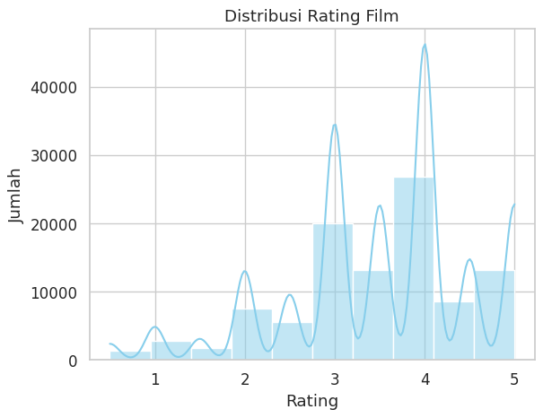

# **Proyek Sistem Rekomendasi Film**

### **Domain Proyek**
---
Film merupakan media ekspresi kontemporer yang mengombinasikan unsur visual dan audio untuk menyampaikan pesan, nilai-nilai budaya, serta hiburan kepada masyarakat. Sebagai karya seni yang kompleks, film tidak hanya menghadirkan cerita melalui gambar bergerak, tetapi juga berperan sebagai sarana edukasi, informasi, dan komunikasi sosial. Keistimewaan film terletak pada kemampuannya dalam memadukan unsur naratif dan teknis sinematik seperti pengambilan gambar, penyuntingan, tata suara, serta pengaturan adegan secara terpadu (Sari et al., 2025).

Transformasi digital mendorong peningkatan aksesibilitas terhadap film melalui platform streaming seperti Netflix. Layanan ini memungkinkan pengguna menonton berbagai film dari seluruh dunia dengan fleksibilitas tinggi. Film telah menjadi bagian penting dalam kehidupan modern, tidak hanya sebagai hiburan tetapi juga sebagai bagian dari gaya hidup. Namun, banyaknya pilihan film justru menghadirkan tantangan baru bagi pengguna, yakni kesulitan dalam menemukan film yang sesuai dengan minat mereka. Ketidaksesuaian ini dapat berdampak pada efisiensi waktu dan kepuasan menonton (Azmi et al., 2024).

Permasalahan tersebut menunjukkan perlunya pengembangan sistem rekomendasi film yang dapat memberikan saran secara personal berdasarkan preferensi pengguna. Sistem rekomendasi memiliki potensi untuk meningkatkan kenyamanan dan efisiensi dalam memilih tontonan yang relevan. Dengan memanfaatkan data pengguna dan informasi film seperti genre atau rating, sistem ini mampu menghasilkan daftar rekomendasi yang lebih terarah dan sesuai kebutuhan individu (Fitriyeh et al., 2024).

Penelitian sebelumnya telah mengembangkan berbagai metode untuk membangun sistem rekomendasi film yang adaptif. Velamentosa dan Zuliarso (2025) berhasil mengimplementasikan pendekatan Content-Based Filtering (CBF) yang memanfaatkan atribut film seperti genre, sinopsis, sutradara, dan aktor untuk menghitung kesamaan antarfilm. Sistem ini menunjukkan performa yang baik dengan nilai precision 85%, recall 78%, dan F1-Score 81%, menandakan kemampuannya dalam menghasilkan rekomendasi yang relevan.

Selain itu, pendekatan berbasis neural network yang dikembangkan oleh Laras dan Hasrullah (2025) menunjukkan hasil yang menjanjikan, dengan nilai RMSE sebesar 1.01, serta precision 0.89, recall 0.81, dan F1-Score 0.85. Angka-angka tersebut mengindikasikan bahwa sistem mampu memprediksi preferensi pengguna secara akurat dan seimbang antara relevansi dan cakupan rekomendasi.

Berdasarkan latar belakang tersebut, penelitian ini bertujuan untuk membangun sistem rekomendasi film yang cerdas, kontekstual, dan adaptif dengan memanfaatkan data pengguna dari dataset MovieLens. Sistem ini diharapkan mampu meningkatkan relevansi rekomendasi film dan memberikan pengalaman menonton yang lebih personal, efisien, dan menyenangkan bagi pengguna.

### **Business Understanding**
---
- **Problem Statements**
    1. Bagaimana merancang sistem rekomendasi film yang mampu memberikan saran tontonan yang relevan dan personal berdasarkan preferensi pengguna?

    2. Pendekatan mana yang lebih efektif antara Content-Based Filtering dan Collaborative Filtering berbasis deep learning dalam menghasilkan rekomendasi film yang akurat dan memuaskan?

- **Goals**
    1. Mengembangkan sistem rekomendasi film yang cerdas dan adaptif menggunakan data pengguna dari MovieLens.

    2. Membandingkan performa dua pendekatan utama rekomendasi, yaitu Content-Based Filtering dan Collaborative Filtering berbasis neural network.

    3. Mengevaluasi efektivitas sistem rekomendasi berdasarkan metrik seperti precision, recall, dan F1-score untuk memastikan kualitas saran film yang diberikan kepada pengguna.

- **Solution Statements**
    1. Membangun pipeline sistem rekomendasi film, mulai dari eksplorasi data (EDA), preprocessing, pemodelan, hingga evaluasi hasil.

    2. Mengimplementasikan pendekatan Content-Based Filtering dengan memanfaatkan fitur film seperti genre, sinopsis, dan rating, serta pendekatan Collaborative Filtering berbasis deep learning yang menggunakan data interaksi pengguna film.

    3. Melakukan transformasi data, ekstraksi fitur, normalisasi, dan embedding untuk mengoptimalkan performa model.

    4. Menggunakan metrik evaluasi seperti precision, recall, dan F1-score untuk menilai relevansi serta kualitas rekomendasi yang dihasilkan sistem.

### **Data Understanding**
---
Proyek ini menggunakan [**MovieLens Latest Small Dataset**](https://www.kaggle.com/code/ldh2306/movie-recommendation-user-based), yaitu kumpulan data yang merekam aktivitas pemberian rating dengan skala 5 bintang serta aktivitas penandaan (tagging) bebas oleh pengguna terhadap film. Dataset ini berasal dari layanan rekomendasi film MovieLens dan telah menjadi salah satu sumber data yang paling banyak digunakan dalam penelitian dan pengembangan sistem rekomendasi. Dataset ini mencakup 100.836 data rating, 3.683 tag, 9.742 film, dan melibatkan 610 pengguna. Rentang waktu pengumpulan data dimulai sejak 29 Maret 1996 hingga 24 September 2018, dan versi terakhir dataset ini dirilis pada 26 September 2018. Seluruh pengguna dipilih secara acak dengan syarat telah memberikan minimal 20 rating. Meskipun demikian, dataset ini tidak memuat informasi demografis seperti usia, jenis kelamin, atau lokasi; setiap pengguna hanya direpresentasikan melalui userId sebagai identitas anonim.

Dataset ini terbagi dalam beberapa file utama, yaitu:

- ratings.csv – berisi informasi rating dari pengguna terhadap film, dengan atribut userId, movieId, rating, dan timestamp.

- movies.csv – berisi metadata film, termasuk movieId, title, dan genres.

- tags.csv – memuat tag yang diberikan pengguna kepada film tertentu, mencerminkan persepsi atau penilaian bebas terhadap konten film.

- links.csv – berisi tautan referensi dari movieId ke ID film di berbagai platform seperti IMDb dan TMDb.

Fitur-fitur yang digunakan dalam penelitian ini antara lain:

- userId: ID unik yang merepresentasikan pengguna.

- movieId: ID unik yang merepresentasikan film.

- rating: Skor penilaian yang diberikan pengguna terhadap film (dalam skala 1–5).

- title: Judul film.

- genres: Genre atau kategori film, dapat lebih dari satu.

- tag: Label bebas yang diberikan pengguna.

- timestamp: Waktu pemberian rating atau tag (dalam format Unix time).

| No | Kolom      | Tipe Data  | Jumlah Non-Null |
|----|------------|------------|------------------|
| 1  | userId     | int64      | 100836           |
| 2  | movieId    | int64      | 100836           |
| 3  | rating     | float64    | 100836           |
| 4  | timestamp  | int64      | 100836           |
| 5  | title      | object     | 100836           |
| 6  | genres     | object     | 100836           |
| 7  | tag        | object     | 1635             |

Untuk menjamin kualitas data, dilakukan pengecekan terhadap keberadaan baris data yang identik (duplikat) serta memastikan bahwa seluruh nilai pada dataset tercatat lengkap tanpa adanya nilai yang hilang (missing values).

```python
# cek duplikat
print("Jumlah duplikat: ", df.duplicated().sum())

Output:
Jumlah duplikat: 0
```
Tidak terdapat duplikat data dalam dataset sehingga tidak perlu penanganan lebih lanjut dalam dataset.

```python
# cek missing value
print("Jumlah missing value: ")
print(df.isnull().sum())

Output:
Jumlah missing value: 
userId           0
movieId          0
rating           0
timestamp        0
title            0
genres           0
tag          99201
```
Kolom `tag` memiliki nilai yang hilang (missing values) karena tidak semua pengguna memberikan tag terhadap film. Kehadiran nilai kosong pada kolom ini tidak memengaruhi kualitas data secara keseluruhan, karena tag bersifat opsional dan hanya merupakan informasi tambahan dari pengguna.

Tahapan berikutnya setelah proses data understanding adalah eksplorasi data atau Exploratory Data Analysis (EDA). Proses ini dilakukan untuk memperoleh pemahaman yang lebih mendalam mengenai struktur dan karakteristik data, seperti pola perilaku pengguna dalam memberikan rating, distribusi genre film, serta kecenderungan penambahan tag. Analisis dilakukan secara univariat untuk meninjau masing-masing variabel secara individu, dan secara multivariat untuk menelaah hubungan antar variabel. Melalui EDA, dapat diidentifikasi berbagai informasi penting seperti film yang paling populer, pengguna yang paling aktif, serta genre yang paling diminati, yang semuanya menjadi dasar dalam pengembangan sistem rekomendasi film yang relevan dan personal.


Gambar di atas memperlihatkan sebaran rating yang diberikan pengguna terhadap film di dalam dataset. Terlihat bahwa mayoritas pengguna cenderung memberikan rating pada skala menengah hingga tinggi, khususnya di angka 4 dan 5. Hal ini menunjukkan adanya bias positif dalam proses evaluasi, yang merupakan fenomena umum dalam sistem rating terbuka, di mana pengguna cenderung hanya memberikan penilaian terhadap film yang mereka sukai atau telah mereka pilih secara selektif. 


Visualisasi di atas menunjukkan sepuluh film dengan jumlah rating terbanyak dari pengguna dalam dataset sistem rekomendasi film. Film dengan rating terbanyak adalah Forrest Gump (1994) dengan 329 rating, diikuti oleh The Shawshank Redemption (1994) dan Pulp Fiction (1994) dengan masing-masing 317 dan 307 rating. Sebagian besar film yang masuk dalam daftar ini merupakan film klasik dari era 1990-an, yang menandakan adanya kecenderungan pengguna untuk memberikan rating terhadap film-film ikonik atau yang memiliki nilai nostalgia tinggi.


Bar chart ini menunjukkan distribusi sepuluh genre film yang paling banyak muncul berdasarkan jumlah rating yang tercatat dalam dataset. Genre Drama merupakan yang paling dominan dengan total 41.928 entri, diikuti oleh Comedy (39.053), Action (30.635), dan Thriller (26.452). Urutan ini mencerminkan kecenderungan pengguna untuk lebih banyak menonton dan memberi rating pada film-film dengan narasi kuat atau hiburan populer. Genre Adventure, Romance, dan Sci-Fi juga memiliki jumlah signifikan, menandakan bahwa variasi tema menjadi faktor penting dalam konsumsi film. Di sisi lain, genre seperti Fantasy (11.834) dan Children (9.208) menunjukkan keterwakilan yang lebih rendah, yang bisa jadi disebabkan oleh segmentasi usia pengguna atau keterbatasan dalam ketersediaan konten genre tersebut dalam dataset.


Bar chart ini menunjukkan sepuluh genre film dengan rata-rata rating tertinggi dalam dataset. Genre Film-Noir berada di peringkat pertama dengan nilai rata-rata sebesar 3,92, disusul oleh War (3,81) dan Documentary (3,80), yang menunjukkan bahwa film dalam genre-genre ini cenderung mendapat apresiasi lebih tinggi dari pengguna. Meskipun tidak selalu menjadi genre dengan jumlah penilaian terbanyak, tingginya rata-rata ini mengindikasikan adanya persepsi kualitas atau nilai artistik yang lebih kuat pada genre-genre tersebut. Genre seperti Crime dan Drama yang lebih umum juga masuk dalam daftar, sementara genre yang lebih spesifik seperti IMAX dan Western menunjukkan kualitas yang relatif tinggi meskipun tidak terlalu dominan secara kuantitatif.


Bar chart ini menampilkan sepuluh pengguna dengan jumlah rating terbanyak dalam dataset, yang menunjukkan tingkat aktivitas individu dalam memberikan evaluasi terhadap film. Pengguna dengan ID 414 tercatat sebagai yang paling aktif dengan total 2.698 rating, disusul oleh ID 599 (2.478 rating) dan ID 474 (2.108 rating). Seluruh pengguna dalam daftar ini telah memberikan lebih dari seribu rating, menunjukkan konsistensi dan keterlibatan tinggi dalam interaksi dengan data film. Pola ini mencerminkan adanya sekelompok kecil pengguna yang berkontribusi secara signifikan terhadap volume data, yang umum ditemukan dalam distribusi partisipasi berbasis pengguna, di mana sebagian besar kontribusi berasal dari minoritas pengguna yang sangat akti


Word cloud ini merepresentasikan kata-kata kunci atau tag yang paling sering diasosiasikan dengan film dalam dataset, di mana ukuran kata mencerminkan frekuensi kemunculannya. Tag seperti netflix queue, thought provoking, superhero, sci-fi, dan comedy muncul dalam ukuran besar, menunjukkan bahwa tema-tema tersebut sering digunakan untuk mendeskripsikan atau mengkategorikan film. Kehadiran kata-kata seperti surreal, psychology, mental illness, dan dark comedy mengindikasikan adanya preferensi pengguna terhadap film-film dengan tema kompleks, atmosferik, atau emosional. Di sisi lain, tag seperti high school, time travel, dan action menunjukkan keberagaman dalam genre dan konteks cerita. 

Sebelum memasuki tahap pemodelan, dilakukan analisis statistik deskriptif terhadap variabel numerik pada dataset untuk memperoleh gambaran umum mengenai distribusi data. Analisis ini mencakup ukuran-ukuran seperti jumlah data (count), rata-rata (mean), standar deviasi (std), nilai minimum dan maksimum, serta kuartil pertama (Q1), median (Q2), dan kuartil ketiga (Q3).

| Kolom    | Count     | Mean   | Std     | Min  | 25%   | 50%   | 75%   | Max     |
|----------|-----------|--------|---------|------|-------|-------|-------|---------|
| userId   | 100836.00 | 326.13 | 182.62  | 1.00 | 177.00| 325.00| 477.00| 610.00  |
| movieId  | 100836.00 | 19435.30 | 35530.99 | 1.00 | 1199.00 | 2991.00 | 8122.00 | 193609.00 |
| rating   | 100836.00 | 3.50   | 1.04    | 0.50 | 3.00 | 3.50  | 4.00  | 5.00    |

Hasil statistik deskriptif menunjukkan bahwa Rata-rata rating berada di angka 3.5 dengan distribusi yang simetris, mengindikasikan bahwa mayoritas pengguna memberikan penilaian dalam rentang menengah hingga tinggi. Hal ini mencerminkan pola penilaian yang cenderung positif terhadap film yang mereka tonton.

### **Data Preparation**
---
Tahap data preparation adalah langkah penting sebelum membangun sistem rekomendasi, karena memastikan bahwa data yang digunakan sudah bersih, relevan, dan siap untuk diproses oleh algoritma. Proses ini mencakup pembersihan data, transformasi nilai, serta pemilihan fitur yang sesuai dengan metode yang akan digunakan.

Dalam penelitian ini, proses persiapan data dibagi menjadi dua bagian berdasarkan pendekatan utama yang digunakan, yaitu Content-Based Filtering dan Collaborative Filtering. Pembagian ini dilakukan karena masing-masing pendekatan membutuhkan format data dan fitur yang berbeda, sesuai dengan cara kerja model rekomendasinya.

1. **Content Based Filtering**
```python
# Gabungkan genre + tag jadi fitur konten
df['tag'] = df['tag'].fillna('')
df['content'] = df['genres'].fillna('') + ' ' + df['tag']
```
Pada tahap ini, dilakukan penggabungan dua fitur teks, yaitu genres dan tag, menjadi satu fitur baru bernama content. Nilai kosong pada kolom tag atau genres diisi dengan string kosong ('') agar proses penggabungan berjalan tanpa error. Fitur content ini akan digunakan untuk membangun representasi konten film dalam pendekatan Content-Based Filtering.

```python
# Ambil satu baris per film
df_content = df.groupby('movieId').agg({
    'title': 'first',
    'content': lambda x: ' '.join(x)
}).reset_index()

df_content = pd.merge(df_content, df_movies[['movieId', 'genres']], on='movieId', how='left')
```
Karena satu film bisa memiliki banyak entri tag, maka dilakukan pengelompokan data berdasarkan movieId. Untuk tiap film, hanya satu title yang diambil (menggunakan fungsi first), dan semua konten (gabungan genre dan tag) digabungkan menjadi satu string panjang. Ini bertujuan untuk membuat satu representasi tekstual yang utuh untuk setiap film. Setelah itu, data genre dari file asli df_movies ditambahkan kembali.

```python
# TF-IDF Vectorizer
tfidf = TfidfVectorizer(stop_words='english')
tfidf_matrix = tfidf.fit_transform(df_content['content'])

# Hitung similarity antar film
cosine_sim = cosine_similarity(tfidf_matrix, tfidf_matrix)
```
Data pada kolom content kemudian diubah menjadi bentuk numerik menggunakan metode TF-IDF (Term Frequency–Inverse Document Frequency) agar dapat diproses oleh model. TF-IDF membantu mengenali seberapa penting suatu kata dalam representasi teks. Selanjutnya, dihitung skor kemiripan antar film menggunakan cosine similarity, yang menjadi dasar dalam merekomendasikan film yang memiliki kesamaan konten.

2. **Collaborative Filtering**
```python
# Encode userId dan movieId
user_enc = LabelEncoder()
movie_enc = LabelEncoder()
df_cf = df[['userId', 'movieId', 'rating']].dropna().copy()
df_cf['user'] = user_enc.fit_transform(df_cf['userId'])
df_cf['movie'] = movie_enc.fit_transform(df_cf['movieId'])
```
Dalam pendekatan Collaborative Filtering berbasis matrix factorization atau neural network, diperlukan representasi numerik dari user dan movie. Oleh karena itu, dilakukan encoding terhadap userId dan movieId menggunakan LabelEncoder untuk mengubah nilai ID menjadi integer berturut. Ini penting karena model tidak dapat memproses ID non-numerik secara langsung.

```python
# Collect sum unique user and movie
n_users = df_cf['user'].nunique()
n_movies = df_cf['movie'].nunique()
```
Langkah ini berguna untuk mengetahui dimensi dari matriks interaksi user-item yang akan dibentuk atau digunakan sebagai input model, serta untuk mendesain layer embedding jika menggunakan model berbasis deep learning.

```python
# Train-test split
X = df_cf[['user', 'movie']]
y = df_cf['rating']
X_train, X_test, y_train, y_test = train_test_split(X, y, test_size=0.2, random_state=42)
```
Data dipisahkan menjadi dua bagian: data pelatihan dan data pengujian. Tujuannya agar performa model dapat diuji secara objektif terhadap data yang belum pernah dilihat sebelumnya, menjaga generalisasi model.

```python
# Scaling data
scaler = MinMaxScaler()
y_train_scaled = scaler.fit_transform(y_train.values.reshape(-1, 1))
y_test_scaled = scaler.transform(y_test.values.reshape(-1, 1))
```
Nilai rating ditransformasi ke dalam rentang [0, 1] menggunakan MinMaxScaler agar proses pelatihan lebih stabil dan cepat konvergen, terutama saat menggunakan neural network. Scaling juga membantu model menghindari bias terhadap skala fitur yang besar.

### **Modelling dan Result**
---
Pada tahap ini, dilakukan pembangunan dan evaluasi model sistem rekomendasi berdasarkan dua pendekatan utama, yaitu Content-Based Filtering dan Collaborative Filtering berbasis deep learning. Masing-masing pendekatan dibangun berdasarkan hasil proses eksplorasi dan persiapan data sebelumnya. Tujuan dari tahap ini adalah untuk menguji efektivitas model dalam memberikan rekomendasi film yang relevan, serta membandingkan performa antar pendekatan berdasarkan metrik evaluasi yang digunakan.

1. Content Based Filtering (CBF)

    Content-Based Filtering merupakan pendekatan yang merekomendasikan item yang mirip dengan item yang disukai atau dikonsumsi sebelumnya oleh pengguna. Sistem ini menggunakan informasi atau atribut yang melekat pada item, seperti genre, kata kunci, tag, deskripsi, dan lain sebagainya.

    Dalam penelitian ini, pendekatan CBF dibangun berdasarkan kombinasi genre dan tag dari film. Kedua fitur ini digabung menjadi satu representasi teks, lalu diekstraksi menggunakan metode TF-IDF (Term Frequency – Inverse Document Frequency) untuk membentuk vektor representasi masing-masing film.
    Rumus TF-IDF:
    $$\text{TF-IDF}(t, d) = \text{TF}(t, d) \times \log\left(\frac{N}{n_t}\right)$$
    dengan
    - TF(t, d) = frekuensi kemunculan term t dalam dokumen d

    - N = jumlah total dokumen

    - $n_t$ = jumlah dokumen yang mengandung term t

    Kemiripan antar film dihitung menggunakan cosine similarity, yang mengukur sudut antar dua vektor dalam ruang berdimensi tinggi:
    $$\cos(\theta) = \frac{A \cdot B}{\|A\| \|B\|}$$
    dengan
    - A, B = vektor representasi dua film

    - $A · B$= dot product antara vektor A dan B

    - $||A||, ||B||$ = panjang (norma) dari masing-masing vektor
    Semakin besar nilai cosine similarity antara dua film, semakin tinggi kemiripan kontennya, dan semakin besar kemungkinan film tersebut direkomendasikan kepada pengguna.

    Berikut ini adalah hasil dari Content Based Filtering
    
    Proses CBF dimulai dengan mencocokkan judul film yang diberikan oleh pengguna dengan data yang tersedia untuk menemukan indeks film tersebut. Selanjutnya, sistem menghitung kemiripan antara film input dan seluruh film lainnya menggunakan nilai cosine similarity yang diperoleh dari representasi konten film berupa gabungan genre dan tag yang telah diubah menjadi vektor melalui metode TF-IDF. Setelah semua skor kemiripan dihitung, sistem mengurutkannya dari yang paling tinggi dan memilih sejumlah film dengan kemiripan tertinggi (kecuali film yang dipilih) untuk dijadikan rekomendasi. Film-film yang direkomendasikan ini dianggap memiliki kesamaan konten paling dekat dengan film referensi input pengguna.
    
    Hasil rekomendasi yang dihasilkan oleh pendekatan Content-Based Filtering untuk film "Jumanji (1995)" menunjukkan kesesuaian yang cukup tinggi. Kelima film yang direkomendasikan memiliki genre yang identik, yaitu Adventure, Children, dan Fantasy, yang mencerminkan karakteristik utama dari Jumanji. Ini menunjukkan bahwa model berhasil menangkap elemen-elemen konten seperti petualangan anak-anak dan nuansa fantasi sebagai dasar kemiripan. Meskipun belum mempertimbangkan preferensi pengguna secara eksplisit, pendekatan ini cukup efektif dalam menyarankan film dengan tema dan suasana serupa, sehingga cocok untuk pengguna yang menyukai film seperti Jumanji.
    
    Kelebihan dari Content Based Filtering:
    - Personalized: Rekomendasi didasarkan pada item yang disukai pengguna, sehingga lebih relevan secara personal.
    - Tidak bergantung pada data pengguna lain: Sistem tetap dapat memberikan rekomendasi meskipun jumlah pengguna sedikit (tidak terpengaruh masalah cold-start pada sisi user).
    - Interpretabilitas tinggi: Rekomendasi mudah dijelaskan karena didasarkan pada fitur konten (genre, tag) yang jelas dan eksplisit.

    Kelemahan Content Based Filtering:
    - Over-specialization: Sistem cenderung merekomendasikan item yang sangat mirip, sehingga mengurangi keberagaman dan potensi eksplorasi film baru.
    - Terbatas oleh informasi fitur: Jika deskripsi konten tidak lengkap atau tidak representatif, kualitas rekomendasi menurun.
    - Tidak menangkap selera kolektif: Sistem tidak belajar dari perilaku pengguna lain, sehingga tidak bisa mengidentifikasi pola umum yang mungkin relevan.

2. Collaborative Filtering (CF)

    Collaborative Filtering merekomendasikan item berdasarkan kesamaan preferensi antar pengguna atau antar item. Pendekatan ini tidak memerlukan informasi eksplisit dari item, melainkan hanya memanfaatkan interaksi (biasanya berupa rating) antara pengguna dan item.

    Dalam proyek ini, digunakan pendekatan model-based collaborative filtering berbasis deep learning dengan arsitektur yang disebut RecommenderNet. Model ini memetakan pengguna dan film ke dalam vektor laten melalui embedding layer. Prediksi rating dihitung melalui dot product antara embedding pengguna dan film.

    Rumus prediksi rating:
    $$\hat{r}_{ui} = p_u \cdot q_i$$
    dengan
    - $\hat{r}_{ui}$ = rating yang diprediksi oleh pengguna $u$ terhadap item $i$
    - $p_u$ = embedding vector pengguna $u$
    - $q_i$ = embedding vector item $i$

    Model ini dilatih untuk meminimalkan kesalahan prediksi terhadap data aktual menggunakan fungsi loss Root Mean Squared Error (RMSE).

    Berikut ini adalah hasil dari Collaborative Filtering
    
    Proses rekomendasi menggunakan pendekatan Collaborative Filtering dimulai dengan mengidentifikasi pengguna berdasarkan ID mentah dan mengubahnya menjadi format numerik yang dapat diproses oleh model. Selanjutnya, sistem mengevaluasi film-film yang sudah ditonton oleh pengguna tersebut, termasuk rating yang diberikan, untuk menentukan preferensi historisnya. Film-film yang belum pernah ditonton oleh pengguna kemudian dipasangkan dengan ID pengguna dan dimasukkan ke dalam model deep learning (RecommenderNet) guna memprediksi rating potensial. Film dengan prediksi rating tertinggi dipilih sebagai rekomendasi, dan hasil akhirnya adalah daftar film yang disarankan berdasarkan pola kesamaan perilaku pengguna lain, bukan berdasarkan kemiripan konten.

    Hasil rekomendasi untuk pengguna 522 menunjukkan bahwa sistem collaborative filtering berhasil mengusulkan film-film yang secara umum relevan dengan preferensi pengguna. Berdasarkan riwayat tontonan yang didominasi oleh genre drama, thriller, dan romance dengan rating tinggi (semua bernilai 5.0), sistem merekomendasikan film seperti *Rear Window* dan *The Prestige* yang kuat dalam elemen thriller dan misteri, serta *Casablanca* dan *Hamlet* yang kaya akan drama dan romance. Meskipun tidak semua genre yang disukai pengguna muncul secara eksplisit dalam rekomendasi (misalnya musical atau horror), pendekatan ini tetap mampu mengenali pola preferensi emosional dan naratif pengguna secara efektif melalui perilaku rating pengguna lain yang serupa.

    Kelebihan dari Collaborative Filtering:
    - Tidak membutuhkan informasi konten: CF hanya bergantung pada interaksi (misalnya rating) antara pengguna dan item, sehingga tetap efektif meskipun tidak tersedia metadata seperti genre atau tag.
    - Mampu menangkap preferensi implisit: Karena mempelajari pola dari perilaku pengguna lain yang serupa, CF dapat merekomendasikan item yang mungkin tidak mirip secara konten tapi disukai oleh pengguna dengan selera yang sama.
    - Personalisasi yang tinggi: Sistem CF sangat adaptif terhadap preferensi pengguna individu karena rekomendasi didasarkan pada kemiripan antar pengguna atau antar item yang dinilai.
    
    Kekurangan dari Collaborative Filtering:
    - Cold-start problem: CF sulit bekerja dengan baik untuk pengguna baru (yang belum memberi banyak rating) atau item baru (yang belum banyak dirating), karena tidak cukup data untuk membuat prediksi.
    - Sparsity: Dalam banyak dataset, mayoritas pengguna hanya memberi sedikit rating, sehingga matriks interaksi menjadi sangat jarang (sparse), yang menyulitkan proses pembelajaran model.
    - Scalability: Ketika jumlah pengguna dan item bertambah besar, CF menjadi lebih mahal secara komputasi karena harus menghitung kemiripan atau memprediksi dari banyak kombinasi.

### **Evaluasi**
---
Evaluasi bertujuan untuk mengukur seberapa baik sistem rekomendasi dalam memprediksi dan menyarankan item yang relevan kepada pengguna. Metrik yang digunakan bisa dibagi menjadi dua jenis:
- Metrik klasifikasi: Precision, Recall, F1-Score (biasanya digunakan untuk evaluasi top-N recommendation).
- Metrik regresi: RMSE (Root Mean Square Error) digunakan untuk mengukur seberapa akurat sistem dalam memprediksi rating numerik.

Berikut penjelasan masing-masing metrik:

1. Precision
    Precision mengukur proporsi item yang direkomendasikan yang benar-benar relevan untuk pengguna.
    $$\text{Precision} = \frac{TP}{TP + FP}$$
    dengan
    - TP: True Positive (item relevan yang direkomendasikan)
    - FP: False Positive (item tidak relevan tapi direkomendasikan)

2. Recall
    Recall mengukur seberapa banyak item relevan yang berhasil ditemukan oleh sistem dari seluruh item relevan yang tersedia.
    $$\text{Recall} = \frac{TP}{TP + FN}$$
    dengan
    - FN: False Negative (item relevan yang tidak direkomendasikan)

3. F1 Score
    F1-Score adalah harmonic mean dari precision dan recall.
    $$\text{F1 Score} = 2 \times \frac{(\text{Precision} \times \text{Recall})}{(\text{Precision} + \text{Recall})}$$

4. RMSE
    RMSE digunakan dalam sistem rekomendasi berbasis rating (RecommenderNet) untuk mengukur seberapa besar rata-rata kesalahan prediksi terhadap rating aktual.
    $$RMSE = \sqrt{\frac{1}{n} \sum (r_{ui} - \hat{r}_{ui})^2}$$
    dengan
    - $r_{ui}$ = rating aktual
    - $\hat{r}_{ui}$ = rating yang diprediksi
    - $n$ =  jumlah pasangan user-item dalam data latih

Pada Collaborative Filtering menggunakan RecommenderNet didapatkan hasil sebagai berikut

Selama proses pelatihan model RecommenderNet, loss dan Root Mean Squared Error (RMSE) pada data pelatihan dan validasi menurun secara konsisten hingga mencapai titik optimal. RMSE validasi dimulai dari 0.2166 di epoch pertama dan turun stabil hingga sekitar 0.2021 pada epoch ke-11, menunjukkan bahwa model belajar dengan baik dalam memprediksi rating pengguna. Setelah tidak ada lagi perbaikan signifikan, proses pelatihan dihentikan secara otomatis pada epoch ke-16 menggunakan teknik early stopping untuk mencegah overfitting.

Setelah model dilatih, dilakukan evaluasi pada data test yang benar-benar belum dilihat oleh model sebelumnya. Hasilnya menunjukkan bahwa RMSE pada data test adalah 0.2044 menandakan bahwa model memiliki generalisasi yang baik terhadap data baru. 

Hasil evaluasi Content-Based Filtering (CBF) menunjukkan performa yang sangat baik dalam memberikan rekomendasi kepada pengguna. Berdasarkan metrik yang dihitung, yaitu precision, recall, dan F1-score, sebagian besar rekomendasi memiliki nilai 1.000000 untuk precision, recall, dan F1-score, yang menunjukkan bahwa sistem mampu merekomendasikan film yang sangat relevan dan sesuai dengan preferensi pengguna yang dicontohkan. Khususnya, pada rata-rata metrik, sistem ini berhasil mencatatkan precision sebesar 0.973, recall 0.99, dan F1-score 0.978, menandakan bahwa meskipun ada beberapa variasi kecil dalam kinerja per rekomendasi, secara keseluruhan sistem dapat memberikan rekomendasi yang sangat akurat dan efisien dalam mengenali film yang relevan untuk setiap pengguna.

Evaluasi Collaborative Filtering (CF) menunjukkan hasil yang bervariasi di antara pengguna, dengan rata-rata precision, recall, dan F1-score sebesar 0.6517. Beberapa pengguna memiliki skor yang lebih rendah, seperti userId 439 dan 371 dengan skor sekitar 0.50, yang menunjukkan bahwa rekomendasi yang diberikan tidak sepenuhnya sesuai dengan preferensi mereka. Namun, ada juga pengguna yang menunjukkan performa sangat baik dengan skor 1.0, seperti userId 598 dan 94, yang mengindikasikan bahwa sistem berhasil memberikan rekomendasi yang sangat relevan. Secara keseluruhan, meskipun ada ketidakteraturan di antara individu, model CF menunjukkan kemampuan untuk menghasilkan rekomendasi yang lebih baik pada beberapa pengguna, tetapi ada ruang untuk peningkatan, terutama dalam menyesuaikan rekomendasi dengan preferensi spesifik pengguna.

### **Kesimpulan**
---
Berdasarkan analisis dan eksperimen yang telah dilakukan, kesimpulan yang dapat diambil adalah sebagai berikut:

1. Sistem Rekomendasi yang Efektif: Sistem rekomendasi film yang efektif dapat dirancang dengan menggunakan pendekatan Content-Based Filtering (CBF) dan Collaborative Filtering (CF) berbasis deep learning, yang mempertimbangkan preferensi pengguna untuk memberikan rekomendasi yang relevan dan personal.

2. Pendekatan Content-Based Filtering (CBF): CBF berhasil memberikan rekomendasi yang relevan dengan menilai kesamaan genre antara film yang telah ditonton pengguna dengan film lainnya. Evaluasi model menunjukkan tingkat precision, recall, dan F1-score yang cukup tinggi, menandakan bahwa rekomendasi yang diberikan sesuai dengan preferensi pengguna. Namun, pendekatan ini cenderung terbatas dalam memberikan variasi genre, karena hanya berfokus pada konten yang mirip dengan film yang sudah ditonton.

3. Pendekatan Collaborative Filtering (CF) Berbasis Deep Learning: CF berbasis deep learning menunjukkan kemampuan untuk menangkap pola interaksi yang lebih kompleks antar pengguna dan item. Meskipun hasil precision, recall, dan F1-score pada beberapa pengguna lebih rendah, CF menunjukkan hasil yang sangat baik untuk pengguna dengan pola interaksi yang lebih jelas. Pendekatan ini memerlukan lebih banyak data untuk meningkatkan akurasi dan memberikan rekomendasi yang lebih personal.

4. Tujuan Proyek Tercapai
    - Sistem rekomendasi film yang cerdas dan adaptif telah berhasil dikembangkan menggunakan dataset MovieLens. Sistem ini mampu memberikan rekomendasi yang relevan dan personal sesuai dengan preferensi pengguna berdasarkan histori interaksi mereka.
    - Dua pendekatan utama, yaitu Content-Based Filtering (CBF) dan Collaborative Filtering (CF) berbasis neural network (RecommenderNet), telah dikembangkan dan dibandingkan performanya secara menyeluruh.
    - Evaluasi sistem menggunakan metrik precision, recall, dan F1-score menunjukkan bahwa Content-Based Filtering menghasilkan rekomendasi yang sangat akurat untuk sebagian besar pengguna, sedangkan Collaborative Filtering menunjukkan potensi kuat dalam memahami pola interaksi yang lebih dalam antar pengguna dan item, terutama ketika tersedia cukup data.

## **Referensi**
- Azmi, A. H., Mahardika, N. I., Prasetya, R. S. A., & Sari, A. P. (2024). Sistem Rekomendasi Film Berbasis Konten Menggunakan Teknik Cosine Similarity dan TF-IDF. Journal of Multidisciplinary Inquiry in Science, Technology and Educational Research, 1(4), 2135-2145.
- Fitriyeh, F., Haqqi, N., Choiriyah, L. M., & Ifada, N. (2024). Dampak pembobotan pada metode hybrid user-based dan item-based untuk sistem rekomendasi film. Jurnal CoSciTech (Computer Science and Information Technology), 5(3), 516-525.
- Laras, D., & Hasrullah, H. (2025). Analisis Kinerja Sistem Rekomendasi Film Berbasis Deep Learning Menggunakan Model Neural Network Pada Dataset Movielens. Jurnal Locus Penelitian dan Pengabdian, 4(1), 1047-1054.
- Sari, R. A., Isnaini, S. F., & Seniwati, E. (2025). Sistem Rekomendasi Film Menggunakan Content Based Filtering. The Indonesian Journal of Computer Science Research, 4(1), 19-27.
- Velamentosa, D., & Zuliarso, E. (2025). Sistem Rekomendasi Film Menggunakan Metode Content-Based-Filtering. JATI (Jurnal Mahasiswa Teknik Informatika), 9(2), 2918-2922.